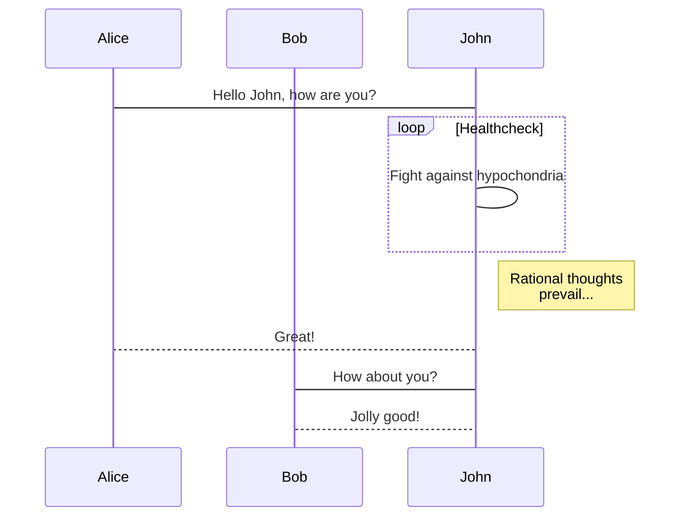

<!-- toc -->

# 使用 gulp 制作组件化工具

## 前言

现在组件化是流行的一种方式，但一般我们都是只是制作适用于当前项目的组件，如使用 react、vue、angular 等前端架构项目，然后把当前复用性比较高的功能抽取出来封装成组件，然后组件有可能是可以使用到另外一个类似项目中去，但目前我们抽取的组件只是限制于在当前项目中，别的项目是没有办法引用这个组件的，那么另外的项目就要重新开发这部分的组件，那么就会做了重复工作了，而且以后同步更新也要修改两套代码，而这时把组件打包放到 npm 上就是可以解决这个重复工作，因为组件的维护都在组件化的项目包里，项目只要使用就行了。

## webpack、rollup 与 gulp 选择

### webpack

WebPack 是一种模块化的解决方案。
Webpack 的工作方式是：把你的项目当做一个整体，通过一个给定的主文件（如：index.js），Webpack 将从这个文件开始找到你的项目的所有依赖文件，使用 loaders 处理它们，最后打包为一个浏览器可识别的 JavaScript 文件，但为了更加完美兼容，打包文件里添加了很多代码使文件的可读性很差。

webpack 兼容性等完善，在应用上开发很适合。

### rollup

rollup 的功能与 webpack 类似，rollup 相对 webpack 而言，要小巧、代码干净利落一些，但不具备 webpack 的一些强大的功能，如热更新，代码分割，公共依赖提取等。
而 vue、react 等使用它进行打包，但它的插件、loader 之类比较少，使用的人也比较少，遇到问题难以从网上寻到答案。

在熟悉它的情况开发类库是不错的选择。

### gulp

Gulp 侧重于前端开发的整个过程的控制管理（像是流水线），我们可以通过给 gulp 配置不同的 task（通过 Gulp 中的 gulp.task()方法配置，比如启动 server、sass/less 预编译、文件的合并压缩等等）来让 gulp 实现不同的功能，从而构建整个前端开发流程。

而 gulp 不会根据文件的引入别的文件而把引入文件也打包了，它只会根据当前文件打包，而代码合并之类的都需要自己实现 task 来实现。
所以在打包多文件时会简单很多且自由度高，因为 gulp 以文件流的形式输入输出，可以对此进行一些操作来实现添加一些逻辑达到某些需要的目标，而 webpack 在这方面就复杂很多，需要自己实现插件来完成某些特殊要求。

### 选择

目前标准:

1. 打包出干净的代码，可读性号
2. 根据组件打包出多个组件文件夹与多个组件文件，包含 ts 文件
3. 可以被 babel-plugin-import 或 ts-import-plugin 实现组件的按需引入
4. 样式文件抽离
5. 打包后的为 es 与 lib 模块
6. 第三方包排除打包

实现起来简单且符合以上条件，webpack 不符合，rollup 勉强符合，但实现多文件与排除第三方等需要多次执行 rollup 配置，遍历的执行，重复执行很多没有必要的重复内容等等，gulp 对多文件打包友好，且可操作流程内容。

gulp 适合。

## gulp 实现打包

### 目录

```
|-- gulp打包文件目录
    |-- package.json
    |-- bin                 // 安装后可执行的命令文件夹
    |   |-- rzzc-tool-run.js
    |   |-- rzzc-tool.js
    |-- demo               // 例子文件夹
    |   |-- components
    |       |-- index.tsx
    |       |-- an-test
    |       |   |-- index.tsx
    |       |   |-- style
    |       |       |-- index.scss
    |       |       |-- index.tsx
    |       |-- style
    |       |   |-- index.scss
    |       |   |-- index.tsx
    |       |-- t-ainamte
    |           |-- index.tsx
    |           |-- tAnimateUtil.tsx
    |           |-- img
    |           |   |-- 123.jpg
    |           |-- style
    |               |-- index.scss
    |               |-- index.tsx
    |-- gulpConfig           // gulp 配置文件夹
        |-- babel.js
        |-- gulpfile.js
        |-- postcssConfig.js
        |-- utils.js

```

### 使用到的插件

```
    gulp

    // typescript转换es6
    gulp-typescript
    typescript

    // es6 转换成符合浏览器执行版本的js，如es5
    gulp-babel
    @babel/core
    @babel/plugin-proposal-class-properties // class类属性转换
    @babel/plugin-proposal-decorators  // 装饰器转换
    @babel/plugin-transform-runtime
    @babel/preset-env
    @babel/preset-react // react转换

    // sass转换css
    gulp-sass
    node-sass
    // css3兼容性处理
    gulp-postcss
    rucksack-css
    autoprefixer

    // react与react-dom的typescript类型
    @types/react
    @types/react-dom

    // 其他
    merge2 // 合并gulp任务，按顺序执行
    rimraf // 删除文件或文件夹
    through2 // 流输出的封装处理
    colorful // 颜色
    commander // 自定义指令
```

### gulp 配置文件目录分析

1. babel.js 相当于 .babelrc 文件
2. postcssConfig.js css 的转换处理文件
3. utils.js 工具文件，如获取执行路径之类
4. gulpfile.js gulp 的配置文件

require.resolve 输入的 path 会以 node_modules 里为起点查询，然后输出绝对路径，不存在会报错。

process.cwd() 当前执行 node 的路径

through2 函数接受的三个参数 file-文件流, encoding-字符编码, next-触发执行下一步流程
文件内容在 file.content 里，对 file.content 转换字符编码就可以正常操作，如 file.content.toString(encoding)
操作完后使用 Buffer.from 转换为二进制内容，既文件流格式

### 按需加载与组件文件夹

typescript 按需加载: ts-import-plugin
babel 按需加载: babel-plugin-import
由于使用的是 antd 的配套按需加载插件，那么一般按一定的目录结构开发才能很好的便利使用。

```
an-test
    |-- index.tsx // 组件入口
    |-- style     // 组件样式文件夹
    |-- index.scss// 组件样式
    |-- index.tsx // 按需加载时加载的样式文件引用
```

以上的结构是最好兼容开发的，但也可以自定义,只是只能自定义 css。

自定义按需加载:

```
{
    libraryName: 'antd',
    libraryDirectory: 'es',
    style: importPath=>{
        return importPath+"/style.css"
    }
}

importPath  组件问价夹路径
拼接上组件css路径

```

## 配置打包目录与清除目录

在 package.json 中自定义一个 customParams 字段;

```

"customParams": {
    "scanRoot": "demo/components",
    "typeRoot": "demo/typings",
    "clean": [
      "es",
      "lib"
    ]
  }

```

根据 scanRoot 与 typeRoot 把组件打包到 es 与 lib
根据 clean 清除目标目录

### 自定义指令

在 package.json 的 bin 里定义自定义指令名称与入口文件

```
"bin": {
    "rzzc-tool": "./bin/rzzc-tool.js"
  }
```

使用 commander 在代码里执行 node 的命令，如 cli 脚手架之类的指令。

首先定义解析语言

```
#!/usr/bin/env node

只能文件顶部加才能生效
```

```
program
  .version(packageInfo.version)
  .command('run [name]', 'run specified task')
  .parse(process.argv);
```

执行子命令，会找到当前文件名加上 run,如 rzzc-tool.js，那么子命令文件就是 rzzc-tool-run.js,然后执行它。
[name] 为参数,这里为 gulp 执行任务的名称，可以从 program.args 中获取。
加载 gulp 配置文件，然后使用 gulp.task(name)返回值再调用就会执行当前任务。
如:

```
const c=gulp.task('clean');
c(); // 就执行清除任务
```

## npm 发布

1. 登陆账号

```
npm login # 输入用户名 密码
```

2. publish

```
npm publish # 需要确保 package.json version 与上一个版本不一样
```

版本的更加

```
// 小版本更改 如从1.0.1->1.0.2
npm version patch
// 中版本更改 如从1.0.1->1.1.0
npm version minor
// 大版本更改 如从1.0.1->2.0.1
npm version major
```

注:
可以 npm 下载下来配置环境然后打包，也可以 github 下载下来 webpack 与 gulp 配合打包

```
// 安装
npm install --save-dev rzzc-tool
```

[具体代码查看 github](https://github.com/793338023/npm-rzzc-tool)



