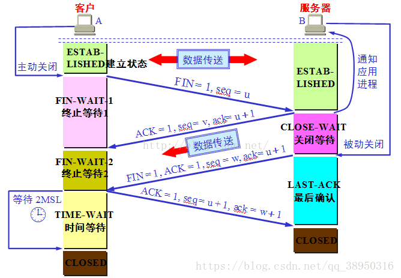

## 前言

使用过 webSocket 的，应该都知道它是使用 TCP 来实现客户端与服务端双工通道，而且连接方式是 ip+端开口号，这为端到端的模式，而由于它的确认方式与断开方式多次确认避免了错误重发导致的错误连接之类的且各种方式保证了它的可靠的交付能力，而 UDP 在这方面就差了些，是不可靠的交付，它只负责发送，不负责确认，所以省去了很多的确认开销，可以很大的提高传送的速度，提高性能，对要求高性能的服务，一般都会使用到 UDP，所以两者有得有失，看需求的倾向。

## 三次握手

第一次握手，建立连接，客户端会把 SYN 发给服务器，进入 SYN_SEND 状态，等待服务器确认，第二次握手，会确认 SYN 包信息，然后在接受信息上添加 SYN+ACK 报文段，发送给客户端，进入 SYN_RECV 状态，第三次握手，客户端接受到报文后向服务器发送 ACK 包，客户端和服务器端都进入 ESTABLISHED 状态。

TCP 进入三次握手是因为预防客户端与服务器端出现丢失包而双方的一方不知道而以为可以正常进入连接状态，这样会会出现 BUG 问题，就好比收快递，如果快递员只送到目的地而不告知或确认是否收到，那么快递丢失，收件员就无法收到快递而损失或不知道快递在哪，这个很不可靠的，而三次握手就会保证连接无误，因为第一次为请求连接，而服务器回应为确认连接，再到客户端的答复为已经收到确认连接，这样是不是就能明确三次握手的必要性。

## 四次挥手

1）客户端进程发出连接释放报文，并且停止发送数据。释放数据报文首部，FIN=1，其序列号为 seq=u（等于前面已经传送过来的数据的最后一个字节的序号加 1），此时，客户端进入 FIN-WAIT-1（终止等待 1）状态。 TCP 规定，FIN 报文段即使不携带数据，也要消耗一个序号。
2）服务器收到连接释放报文，发出确认报文，ACK=1，ack=u+1，并且带上自己的序列号 seq=v，此时，服务端就进入了 CLOSE-WAIT（关闭等待）状态。TCP 服务器通知高层的应用进程，客户端向服务器的方向就释放了，这时候处于半关闭状态，即客户端已经没有数据要发送了，但是服务器若发送数据，客户端依然要接受。这个状态还要持续一段时间，也就是整个 CLOSE-WAIT 状态持续的时间。
3）客户端收到服务器的确认请求后，此时，客户端就进入 FIN-WAIT-2（终止等待 2）状态，等待服务器发送连接释放报文（在这之前还需要接受服务器发送的最后的数据）。
4）服务器将最后的数据发送完毕后，就向客户端发送连接释放报文，FIN=1，ack=u+1，由于在半关闭状态，服务器很可能又发送了一些数据，假定此时的序列号为 seq=w，此时，服务器就进入了 LAST-ACK（最后确认）状态，等待客户端的确认。
5）客户端收到服务器的连接释放报文后，必须发出确认，ACK=1，ack=w+1，而自己的序列号是 seq=u+1，此时，客户端就进入了 TIME-WAIT（时间等待）状态。注意此时 TCP 连接还没有释放，必须经过 2∗∗MSL（最长报文段寿命）的时间后，当客户端撤销相应的 TCB 后，才进入 CLOSED 状态。
6）服务器只要收到了客户端发出的确认，立即进入 CLOSED 状态。同样，撤销 TCB 后，就结束了这次的 TCP 连接。可以看到，服务器结束 TCP 连接的时间要比客户端早一些。

四次挥手是因为客户端的关闭与服务器端关闭都要关闭，每个都有一个请求一个回应，所以就四次。
在服务器关闭时客户端的 TINE_WAIT 是为了确认服务器端是否接受客户端的应答，如若收到，那么服务器端就不会再发送关闭请求，那么客户端在 2[MSL](https://baike.baidu.com/item/MSL/13975171?fr=aladdin)时间后就自动认为服务器端关闭了，结束本次的 TCP 连接，如若收到再次请求关闭，那么就是重置时间再等待 2MSL 时间。

MSL 指一个片段在网络中最大的存活时间

TCP 还设有一个保活计时器，显然，客户端如果出现故障，服务器不能一直等下去，白白浪费资源。服务器每收到一次客户端的请求后都会重新复位这个计时器，时间通常是设置为 2 小时，若两小时还没有收到客户端的任何数据，服务器就会发送一个探测报文段，以后每隔 75 秒钟发送一次。若一连发送 10 个探测报文仍然没反应，服务器就认为客户端出了故障，接着就关闭连接。

## [可靠交付的手段](https://www.jianshu.com/p/4fbb48c4285d)

TCP 是一种提供可靠性交付的协议。
也就是说，通过 TCP 连接传输的数据，无差错、不丢失、不重复、并且按序到达。

### 超时重传

TCP 报文段在传输的过程中，下面的情况都是有可能发生的：

数据包中途丢失；
数据包顺利到达，但对方发送的 ACK 报文中途丢失；
数据包顺利到达，但对方异常未响应 ACK 或被对方丢弃；

当出现这些异常情况时，TCP 就会超时重传。
TCP 每发送一个报文段，就对这个报文段设置一次计时器。只要计时器设置的重传时间到了，但还没有收到确认，就重传这一报文段，这个就叫做「超时重传」。

### 滑动窗口

滑动窗口协议比较复杂，也是 TCP 协议的精髓所在。
TCP 头里有一个字段叫 Window，叫 Advertised-Window，这个字段是接收端告诉发送端自己还有多少缓冲区可以接收数据。于是发送端就可以根据这个接收端的处理能力来发送数据，而不会导致接收端处理不过来。
滑动窗口分为「接收窗口」和「发送窗口」
因为 TCP 协议是全双工的，会话的双方都可以同时接收和发送，那么就需要各自维护一个「发送窗口」和「接收窗口」。

滑动窗口就是在存储有序的内容，当当前的某段内容都确认后就滑动到确认区域内，而某段内容之前有丢失的，那么后面的只能等待丢失的确认后才能有序滑到确认区域。
