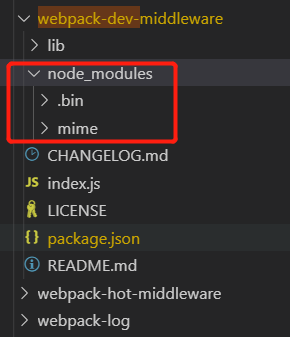

# npm、nrm 与 npx

## 前言

NPM 是随同 NodeJS 一起安装的包管理工具，能解决 NodeJS 代码部署上的很多问题，如允许用户从 NPM 服务器下载别人编写的第三方包到本地使用、允许用户从 NPM 服务器下载并安装别人编写的命令行程序到本地使用、允许用户将自己编写的包或命令行程序上传到 NPM 服务器供别人使用。

以下的操作系统都已 window 的为主，且主要介绍一些我觉得有意思的东西，如简化命令，package.json 里的属性作用等，还有 npm 周边的辅助工具 npx 与 nrm,

## npm

### npm 安装与初始化

npm 随着 node 一起安装了，但有时由于 npm 版本不够而需要更新，可以直接更新 npm。

```
// 查看版本
npm -v
// 更新版本
npm install npm -g
```

如果我们初始化一个模块，那么就会执行 npm init，但这样要填写一些信息，然后输出一个初始化的 package.json，我们可以简化它，然后后面有必要再手动填入。

```
// 快速创建
npm init -y
```

### 依赖包安装

依赖管理是 npm 的核心功能，原理就是执行 npm install 从 package.json 中的 dependencies, devDependencies 将依赖包安装到当前目录的 ./node_modules 文件夹中。

而单独安装一个包时，执行 `npm install <package>` 命令即可，但在 npm 里，除了简单的指定包名, package 还可以是一个指向有效包名的 http(网上资源)、url/git(git 上资源，如 github 或私仓的 gitlab 之类)、url/文件夹路径(本地资源)。

其实只要符合 package 的规则就可以安装到 node_modules 里使用。
[package](https://docs.npmjs.com/about-packages-and-modules)的规则有:

- a) 包含由 package.json 文件描述的程序的文件夹。
- b) 含有（a）的压缩的压缩文件，如 module.tar.gz。
- c) 解析为（b）的 URL(通常是 http(s) url)。
- d) 一个格式为 `<name>@<version>` 的字符串，可指向 npm 源(通常是官方源 npmjs.org)上已发布的可访问 url，且该 url 满足条件 (c)。
- e) 一个格式为 `<name>@<tag>` 的字符串，在 npm 源上该`<tag>`指向某 `<version>` 得到 `<name>@<version>`，后者满足条件 (d)。
- f) `<name>`具有 latest 满足（e）的标签的模块。
- g) 一个 git/url, 该 url 所指向的代码库满足条件 (a)。

#### 本地包/git 上的包的安装

这对于私有的不方便 publish 到远程源（即使是私有源），或者需要对某官方源的包进行改造，但依然需要把包共享出去的场景来说非常实用。

1. 如场景一:本地模块引用
   nodejs 应用开发中不可避免有模块间调用，例如在实践中经常会把需要被频繁引用的配置模块放到应用根目录；于是在创建了很多层级的目录、文件后，很可能会遇到这样的代码:

```
const config = require('../../../../config.js');
```

除了看上去很丑以外，这样的路径引用也不利于代码的重构。并且身为程序员的自我修养告诉我们，这样重复的代码多了也就意味着是时候把这个模块分离出来供应用内其他模块共享了。例如这个例子里的 config.js 非常适合封装为 package 放到 node_modules 目录下，共享给同应用内其他模块。
无需手动拷贝文件或者创建软链接到 node_modules 目录，npm 有更优雅的解决方案。

实践方式:
创建 config 包:

- 1. 新增 config 文件夹; 重命名 config.js 为 config/index.js 文件; 创建 package.json 定义 config 包;

```
{
    "name": "config",
    "main": "index.js",
    "version": "0.1.0"
}
```

- 2. 在应用层 package.json 文件中新增依赖项，然后执行 npm install; 或直接执行第 3 步
- 3. （等价于第 2 步）直接在应用目录执行 npm install file:./config
     此时，查看 node_modules 目录我们会发现多出来一个名为 config，指向上层 config/ 文件夹的软链接(可以看作快捷文件夹)。这是因为 npm 识别 file: 协议的 url，得知这个包需要直接从文件系统中获取，会自动创建软链接到 node_modules 中，完成“安装”过程。
     相比手动软链，我们既不需要关心 windows 和 linux 命令差异，又可以显式地将依赖信息固化到 dependencies 字段中，开发团队其他成员可以执行 npm install 后直接使用。

2. 场景二:私有 git 共享 package
   有些时候，我们一个团队内会有一些代码/公用库需要在团队内不同项目间共享，但可能由于包含了敏感内容，或者代码太烂拿不出手等原因，不方便发布到源。

这种情况下，我们可以简单地将被依赖的包托管在私有的 git 仓库中，然后将该 git/url 保存到 dependencies 中. npm 会直接调用系统的 git 命令从 git 仓库拉取包的内容到 node_modules 中。

[npm 支持的 git url 格式:](https://docs.npmjs.com/files/package.json#git-urls-as-dependencies)

```
<protocol>://[<user>[:<password>]@]<hostname>[:<port>][:][/]<path>[#<commit-ish> | #semver:<semver>]
// 一般使用http(s),使用ssh需要设置ssh信息，比较麻烦
npm i https://github.com/facebook/react.git
```

3. 场景 3: 开源 package 问题修复
   使用某个 npm 包时发现它有某个严重 bug，但也许最初作者已不再维护代码了，也许我们工作紧急，没有足够的时间提 issue 给作者再慢慢等作者发布新的修复版本到 npm 源。
   而私自修改 node_modules 里包的内容是很容易出现覆盖等现象，再根源上没有解决而导致问题重现。

解决正确方式:
最好的办法应当是 fork 原作者的 git 库，在自己所属的 repo 下修复问题后，将 dependencies 中相应的依赖项更改为自己修复后版本的 git/url 即可解决问题。（Fork 代码库后，也便于向原作者提交 PR 修复问题。上游代码库修复问题后，再次更新我们的依赖配置也不迟。）

### npm5 与 package-lock

npm5 这一版本最大的变化是增加了 package-lock.json 文件。
package-lock.json 的作用是锁定依赖安装结构，如果查看这个 json 的结构，会发现与 node_modules 目录的文件层级结构是一一对应的。

以依赖关系为:webpack 构建项目为例, 其 package-lock 文件包含了这样的片段。

```
{
"name": "react-test",
  "version": "1.0.0",
  "lockfileVersion": 1,
  "requires": true,
    "dependencies":{
        //...其他依赖包
        "webpack-dev-middleware": {
            "version": "3.7.0",
            "resolved": "https://registry.npmjs.org/webpack-dev-middleware/-/webpack-dev-middleware-3.7.0.tgz",
            "integrity": "sha512-qvDesR1QZRIAZHOE3iQ4CXLZZSQ1lAUsSpnQmlB1PBfoN/xdRjmge3Dok0W4IdaVLJOGJy3sGI4sZHwjRU0PCA==",
            "dev": true,
            "requires": {
                "memory-fs": "^0.4.1",
                "mime": "^2.4.2",
                "range-parser": "^1.2.1",
                "webpack-log": "^2.0.0"
            },
            "dependencies": {
                "mime": {
                "version": "2.4.4",
                "resolved": "https://registry.npmjs.org/mime/-/mime-2.4.4.tgz",
                "integrity": "sha512-LRxmNwziLPT828z+4YkNzloCFC2YM4wrB99k+AV5ZbEyfGNWfG8SO1FUXLmLDBSo89NrJZ4DIWeLjy1CHGhMGA==",
                "dev": true
                }
            }
        },
        //...其他依赖包
    }
}

```

package-lock 其主要字段是 version, resolved, integrity, requires, dependencies 这几个字段而已。
version, integrity, resolved 用来记录包的准确版本号、内容 hash、安装源的，决定了要安装的包的准确“身份”信息。

从 dependencies: {} 里的内容我们会发现，整个文件的 JSON 配置里的 dependencies 层次结构与文件系统中 node_modules 的文件夹层次结构是完全对照的，除最外层的 requires 属性为 true 以外, 其他层的 requires 属性都对应着这个包的 package.json 里记录的自己的依赖项 dependencies 属性，而 dependencies 对应既这个包里 node_modules 所拥有的文件。

如图:



因为这个文件记录了 node_modules 里所有包的结构、层级和版本号甚至安装源，它也就事实上提供了 “保存” node_modules 状态的能力。只要有这样一个 lock 文件，不管在那一台机器上执行 npm install 都会得到完全相同的 node_modules 结果。

package-lock 文件致力于优化的场景:
在从前仅仅用 package.json 记录依赖，由于 包依赖的版本范围的机制；一个月前由 A 生成的 package.json 文件，B 在一个月后根据它执行 npm install 所得到的 node_modules 结果很可能许多包都存在不同的差异，虽然这个机制的限制使得同一份 package.json 不会得到大版本不同的依赖包，但同一份代码在不同环境安装出不同的依赖包，依然是可能导致意外的潜在因素。

而禁止它在.npmrc 设置或命令设置

```
// 在当前项目新建 .npmrc
package-lock=false
// 命令设置，会禁用所有项目package-lock.json
npm config set package-lock false
```

### npm scripts

npm scripts 是 npm 另一个很重要的特性。通过在 package.json 中 scripts 字段定义一个脚本，例如：

```
{
    "scripts": {
        "echo": "echo hello world"
    }
}
```

我们就可以通过 npm run echo 命令来执行这段脚本，像在 shell 中执行该命令 echo hello world 一样，看到终端输出 hello world.
npm scripts 的基本使用就是这么简单，它提供了一个简单的接口用来调用工程相关的脚本。

简单的总结一下:

1. npm run 命令执行时，会把 ./node_modules/.bin/ 目录添加到执行环境的 PATH 变量中，因此如果某个命令行包未全局安装，而只安装在了当前项目的 node_modules 中，通过 npm run 一样可以调用该命令。
2. 执行 npm 脚本时要传入参数，需要在命令后加 -- 标明, 如 npm run test -- --grep="pattern" 可以将 --grep="pattern" 参数传给 test 命令。
3. npm 提供了 pre 和 post 两种钩子机制，可以定义某个脚本前后的执行脚本。
4. 运行时变量：在 npm run 的脚本执行环境内，可以通过环境变量的方式获取许多运行时相关信息，以下都可以通过 process.env 对象访问获得：

- npm_lifecycle_event - 正在运行的脚本名称
- `npm_package_<key>` - 获取当前包 package.json 中某个字段的配置值：如 npm_package_name 获取包名
- `npm_package_<key>_<sub-key>` - package.json 中嵌套字段属性：如 npm_pacakge_dependencies_webpack 可以获取到 package.json 中的 dependencies.webpack 字段的值，即 webpack 的版本号。

### npm bin

上面所说的 node_modules/.bin 目录，保存了依赖目录中所安装的可供调用的命令行包。
何谓命令行包？例如 webpack 就属于一个命令行包。当我们把 webpack 安装到项目的 node_modules 里时当前包里 package.json 的 bin 字段就会配置的 node_modules/.bin 目录里，让我们可以在局部执行避免全局包版本不一致导致的问题。

webpack 在 package.json 文件中定义了 bin 字段为:

```
{
    "bin": {
        "webpack": "./bin/webpack.js"
    }
}
```

而安装在 node_modules/.bin 里的一般通过 npm scripts，否则只能安装到全局里，如:

```
npm i webpack -g
```

这样就可以直接在 cmd 命令行工具使用。

但 npm 也提供了别的方式调用项目里的命令行包，为 npx，下面会单独描述。

### npm 发布

1. 你需要一个 npm[账号](https://www.npmjs.com/)。这是流程的一部分。
2. 在当前项目打开终端输入:

```
npm login
```

你会得到一个让你输入 username、password 和 email 的提示。把它们填在相应的位置吧！

3. 在当前项目打开终端输入:

```
npm publish
```

npm 不许发布已有的包名与相同的版本的包，所以每次发布都需要修改 package.json 的 version。

修改 version 的命令:

```
// version x.y.z
// 自增z
npm version patch
// 自增y
npm version minor
// 自增x
npm version major
```

发布到私仓里，需要 package.json 配置

```
{
    "publishConfig":{
        {"registry":"私仓地址"}
    }
}
```

而发布的时注意 devDependencies 与 dependencies 里的依赖，因为安装在 dependencies 的包会在项目下载这个包时一并下载，而安装到 devDependencies 里的依赖就不会被下载，因为 devDependencies 是开发使用的依赖，而 dependencies 是包需要的依赖，所以在开发 npm 包时需要注意这样的区别，否则包下载会因为不必要的依赖而导致下载缓慢。

4. 撤销发的包
   其实发的包,可能会有人下载了,并在使用,所以撤销包,需要慎重。

```
//撤销发布,需要在24小时内完成操作,下一次再发包,不能发同名的了
$ npm unpublish

//更好的一个做法,是声明遗弃
$ npm deprecate <pkgname>
```

### 基本快捷方式

我们从最基本的开始,学习最常见的 npm 快捷方式从长远来将会节省很多时间。

```
安装  —  常规：npm install，简写：npm i。

测试  —  常规：npm test，简写：npm t。

帮助  —  常规：npm --help，简写：npm -h。

全局标志 —  常规：--global，简写：-g。

保存为开发依赖 - 常规： --save-dev，简写：-D。

保存为项目依赖 - 常规: --save，简：-S。

npm init 默认值 - 常规：npm init --yes 或 npm init --force，简写：npm init -y 或 npm init -f

```

根的快捷方式
. 符号通常用于表示应用程序的根目录，npm 术语中的应用程序入口点，即 package.json 中指定为“main”的值。

```
{
  "main": "index.js"
}
```

当我们需要发布一个包时，直接引用包名就可以使用包，如

```
npm i react
// 当前项目就可以使用
import react from 'react'
// 会直接查看package.json的main字段路径
```

## npx

这个是在 npmv5.2.0 引入的一条命令，引入这个命令的目的是为了提升开发者使用包内提供的命令行工具的体验。

举个例子，我们开发中要运行 webpack 命令来打包，以前有这么几种方式：

1. 全局安装 webpack，但有时不同项目使用不同版本，不允许使用全局包，只能考虑下面一些方法
2. 使用 npm scripts，在 package.json 加一个 script

```
{
    "scripts": {
        "webpack": "webpack"
    }
}
```

然后执行 npm run webpack

3. 将 node_modules 的可执行目录(.bin)加到 PATH 中

```
alias npmx=PATH=$(npm bin):$PATH
```

然后执行 npmx webpack

4. 指定可执行命令路径

```
./node_modules/.bin/webpack
```

现在我们有了 npx 命令，就不在需要考虑以上方法了（其实 npx 是对方法 3 的封装）。当我们执行 webpack 时，会自动去./node_modules/.bin 目录下搜索。
如:

```
npx webpack
```

-p 参数用于指定 npx 所要安装的模块

```
npx -p node@0.12.8 node -v
```

上面命令先指定安装 node@0.12.8，然后再执行 node -v 命令。

## nrm

开发的 npm registry 管理工具 nrm, 能够查看和切换当前使用的 registry,一个比较废的功能，因为我们可以使用`npm config edit`修改配置文件的 registry 达到同样的效果，但可以了解一下。

nrm 的安装

```
npm install -g nrm
```

nrm 命令:

```
nrm ls　　// 查看所有的支持源（有*号的表示当前所使用的源,以下[name]表示源的名称）

nrm use [name]　　// 将npm下载源切换成指定的源

nrm help　　// 查看nrm帮助

nrm home [name]　　// 跳转到指定源的官网

```

当切换源后使用 npm 下载时就会从当前源下载。
